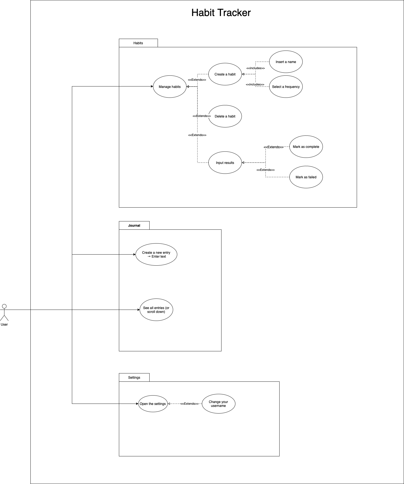

# Habit Tracker

## General Information

Habit Tracker is a Java-based app that combines a habit tracker with a journal to help users form positive habits and improve their daily lives. The app was developed by a team of four university students as part of their Software Development 2 course.

## Features

### Habit Tracking

- Users can add new habits and specify the days they want to accomplish them.
- Habits can be removed at any time.
- Users can track their progress over time by navigating through previous weeks.

### Daily Journal

- Users can write short entries to keep track of their daily thoughts and activities.
- Entries are limited to 200 characters.
- New entries are added to the journal and displayed in reverse chronological order.

### Customization

- Users can change the displayed name through the settings menu.

## Installation and Setup

To install and run the app, follow these steps:

1. Clone the project from the [GitHub repository](https://github.com/stapps21/habit-tracker).
2. Compile the project using Maven: `mvn compile`.
3. Run the app using the command: `mvn exec:java -Dexec.mainClass=com.teampingui.Main`.
4. The app is now ready to use.

Note: Maven and Java must be installed on your computer to run the program.

## Usage

### Tracking Habits

#### Adding a Habit

1. Click the "Add a new habit" button.
2. Fill in the form with the habit's name and the days you want to accomplish it.
3. The new habit will be shown in the table and is ready to be tracked.

#### Removing a Habit

1. Click the "Remove a habit" button.
2. Click the icon next to the habit you want to remove.

#### Navigating Through Previous Weeks

Use the arrow buttons above the table to jump back and forth between weeks, allowing you to review your progress over time.

### Using the Journal

#### Adding a New Entry

1. Type your entry (max 200 characters) in the text area.
2. Click the "Add entry" button.
3. Entries will be displayed in reverse chronological order.

### Changing the Displayed Name

1. Navigate to the settings menu.
2. Enter your desired name.
3. Click the "Save changes" button and return to the main page.

## Use Case Diagram

## Developers

This project was developed by a team of four university students as part of their Software Development 2 course.
